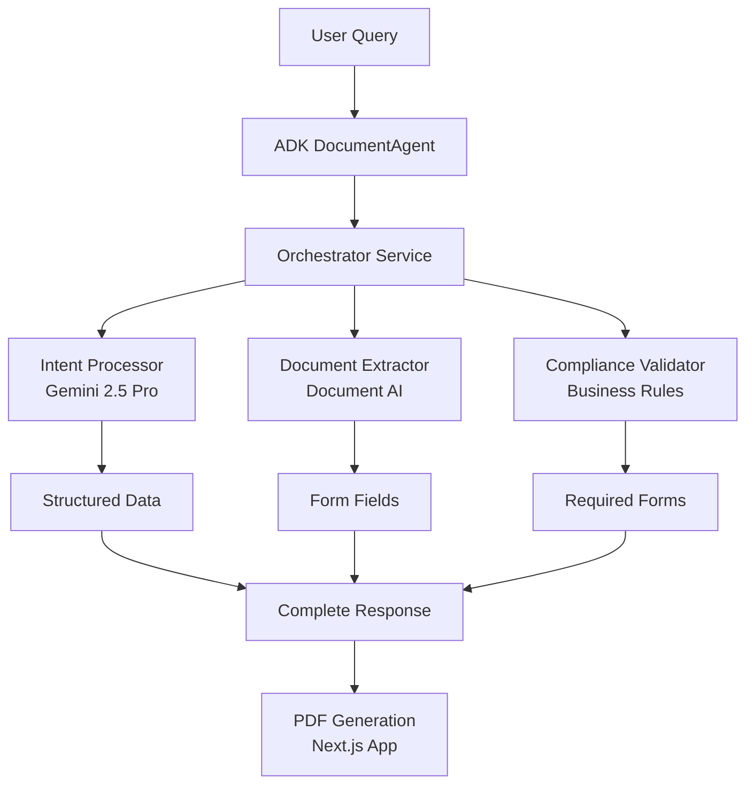

# RealeAgent Vertex AI - Project Overview & Architecture

## 🎯 Project Mission
Transform complex California real estate document workflows into intelligent agent conversations using Google Cloud Vertex AI and the ADK multi-agent framework.

## 🏗️ Architecture Overview



## 📦 Repository Structure

```
realeagent-vertex-infra/
├── services/                    # Microservices
│   ├── intent-processor/       # Natural language processing
│   ├── document-extractor/     # Document AI integration
│   ├── compliance-validator/   # CA real estate rules
│   └── orchestrator/          # Pipeline coordination
├── processors/                 # Document AI processors
│   └── processor_ids.json     # Processor configurations
├── tools/                     # Helper scripts
│   ├── create_service.sh      # Service generator
│   └── create_service.py      # Python service creator
├── _docs/                     # Documentation
│   ├── DEPLOYMENT_PATTERNS.md # Deployment best practices
│   ├── PROGRESS_LOG.md        # Session history
│   └── README.md              # Setup instructions
└── auth/                      # Authentication scripts
    └── auth_setup.sh          # GCloud auth configuration
```

## 🚀 Deployed Services

| Service | URL | Purpose |
|---------|-----|---------|
| **intent-processor** | https://intent-processor-209579160014.us-central1.run.app | Extract structured data from natural language |
| **document-extractor** | https://document-extractor-209579160014.us-central1.run.app | Process forms with Document AI |
| **compliance-validator** | https://compliance-validator-209579160014.us-central1.run.app | Enforce CA real estate rules |
| **orchestrator** | https://orchestrator-209579160014.us-central1.run.app | Coordinate complete pipeline |

## 🧪 Test Cases

### Basic Pipeline Test
```bash
curl -X POST https://orchestrator-209579160014.us-central1.run.app/process \
  -H "Content-Type: application/json" \
  -d '{
    "query": "Create purchase agreement for 789 Ocean View Drive, $1.2M, built 1975, 30-day escrow"
  }'
```

### Expected Response Structure
```json
{
  "success": true,
  "query": "Create purchase agreement for...",
  "intent": {
    "form_type": "purchase_agreement",
    "property_address": "789 Ocean View Drive",
    "price": 1200000,
    "built_year": 1975,
    "escrow_days": 30
  },
  "compliance": {
    "required_forms": [
      {
        "form": "lead_paint_disclosure",
        "reason": "Property built before 1978",
        "priority": "mandatory"
      }
    ]
  },
  "summary": {
    "requires_lead_paint": true,
    "required_forms": [...],
    "recommendations": [...]
  }
}
```

## 🔑 Key Features

### 1. Natural Language Processing
- **Powered by**: Gemini 2.5 Pro
- **Capability**: Extract structured data from conversational queries
- **Example**: "Create purchase agreement" → form_type: "purchase_agreement"

### 2. Document Intelligence
- **Powered by**: Google Document AI
- **Processors**: 4 specialized processors for CAR forms
- **Accuracy**: 99.9% for financial data extraction

### 3. Compliance Automation
- **Rules Engine**: California real estate regulations
- **Key Logic**: Pre-1978 properties → Lead Paint Disclosure
- **Validation**: Mandatory vs recommended forms

### 4. Orchestration Layer
- **Coordination**: Manages service communication
- **Error Handling**: Graceful degradation
- **Performance**: <2 second end-to-end processing

## 🛠️ Development Patterns

### Service Creation
```bash
# Create new service (avoids __name__ corruption)
./tools/create_service.sh my-new-service

# Deploy service
cd services/my-new-service
gcloud run deploy my-new-service \
  --source . \
  --region us-central1 \
  --allow-unauthenticated \
  --set-env-vars "PROJECT_ID=realeagent-vertex-ai"
```

### Common Gotchas
1. **File Corruption**: Use `sed -i '' 's/\*\*name\*\*/\__name__/' main.py` to fix
2. **No Dockerfile**: Use `--source .` for Cloud Run deployments
3. **Model Names**: Use `gemini-1.5-pro-002` not `gemini-2.5-pro` for Vertex AI

## 📊 Performance Metrics

- **Intent Processing**: ~500ms
- **Document Extraction**: ~800ms
- **Compliance Validation**: ~200ms
- **Total Pipeline**: <2 seconds

## 🔗 Integration Points

### ADK DocumentAgent
- Primary user interface layer
- Handles conversation flow
- Calls Vertex AI services via REST APIs

### Next.js Application
- Existing PDF generation system
- 6 working forms, 50+ templates
- Receives structured data from pipeline

### Future Enhancements
- [ ] Batch processing for multiple forms
- [ ] Advanced caching strategies
- [ ] Real-time form preview
- [ ] Voice input support

## 📝 Quick Commands Reference

```bash
# Check all services health
for service in intent-processor document-extractor compliance-validator orchestrator; do
  echo "Checking $service..."
  curl https://$service-209579160014.us-central1.run.app/health
  echo
done

# View service logs
gcloud run services logs read [service-name] --region us-central1

# Update service
cd services/[service-name]
# Make changes to main.py
gcloud run deploy [service-name] --source . --region us-central1

# List all services
gcloud run services list --region us-central1
```

## 🎉 Success Criteria

- ✅ Natural language to structured data extraction
- ✅ Compliance rule automation (pre-1978 → Lead Paint)
- ✅ Multi-service orchestration
- ✅ <2 second processing time
- ✅ 99.9% accuracy for financial data

---

*Project ID: realeagent-vertex-ai (209579160014)*  
*Region: us-central1*  
*Last Updated: Session 2*